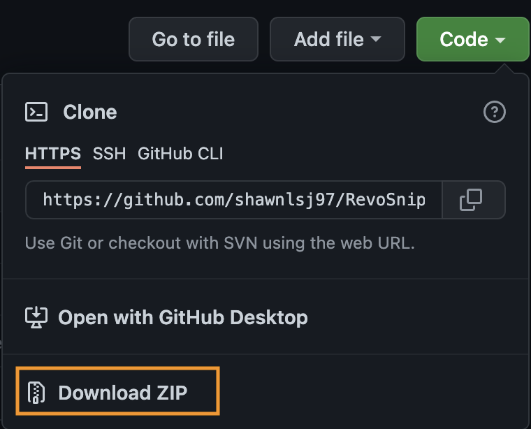
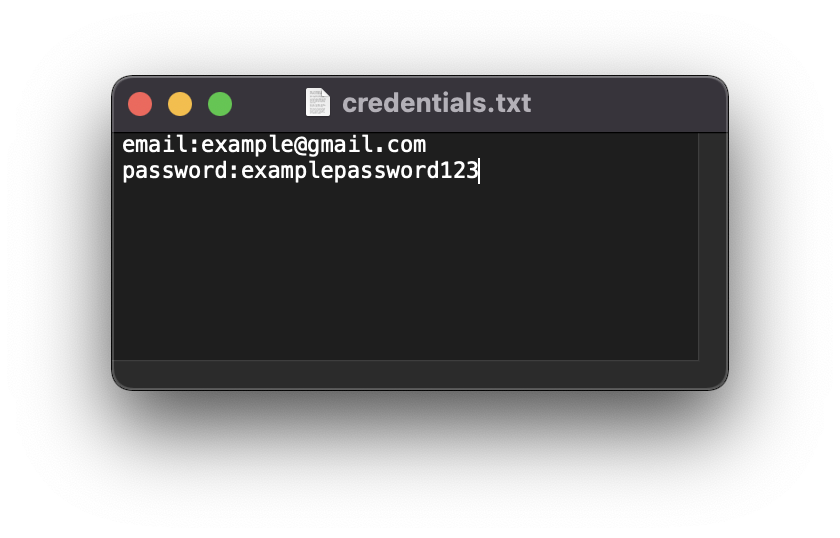
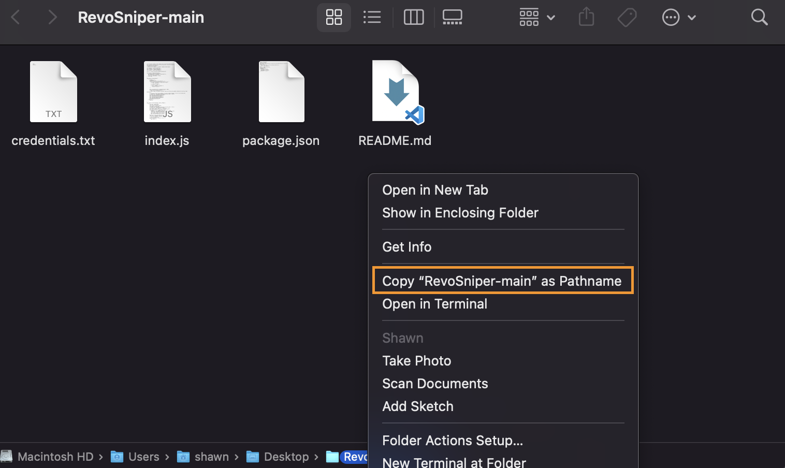
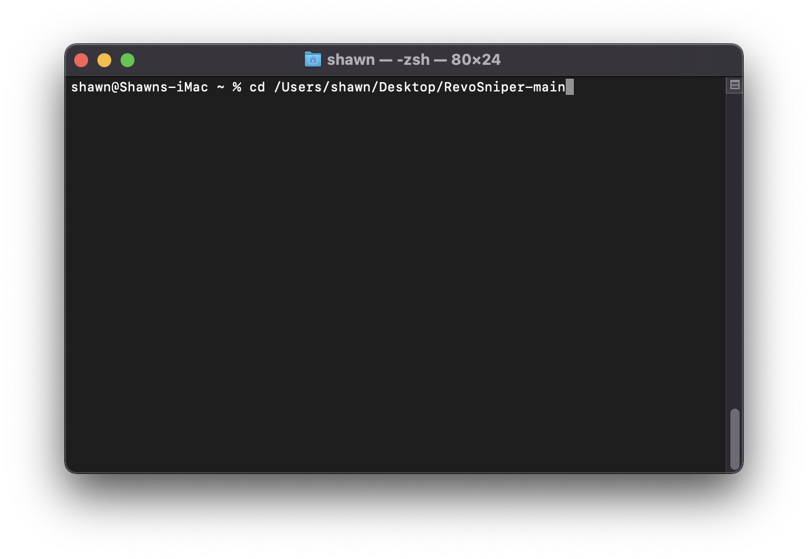
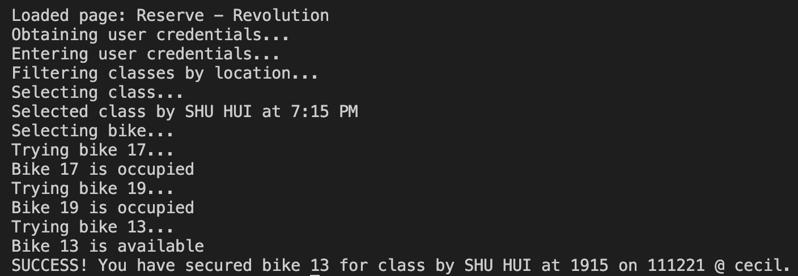

# RevoSniper

RevoSniper is a bot that helps users to secure their Revolution spin class spots with their favourite bikes. With RevoSniper, users can focus more on spinning, and less on booking!

## Using RevoSniper

1. Download and install the LTS version of Node.js from the following link: https://nodejs.org/en/

2. Download / clone this repository<br />


3. Open a file explorer and navigate to the cloned repository and edit the text file with your email and password. This is for RevoSniper to login to the Revolution application, rest assured no data is stored by the bot and all your credentials are stored solely on your computer!
&nbsp;&nbsp;&nbsp;&nbsp;Your credentials.txt file should look like this after you edit it:<br />


4. Open a Terminal and navigate to the cloned repository
&nbsp;&nbsp;&nbsp;&nbsp;For example, if you are using Windows, you can right-click the address bar in File Explorer and select "Copy address as text". If you are using MacOS, click on "View" then "Show Path Bar" in Finder while in the RevoSniper folder, followed by right-clicking the last folder in the Path Bar (RevoSniper-main) and selecting "Copy "RevoSniper-main" as Pathname". <br /><br />In the Terminal, type "cd" and press space, then paste the address you just copied and hit enter. This allows the Terminal to find our program.<br />
<br />

5. Run RevoSniper using one of the following commands, replacing the fields including the <> brackets with the actual details of the class you desire. You may specify as many bikes as you want, each separated by a space
```
node index.js -d <date in DDMMYY format e.g. 071221> -t <time in 24-hr format e.g. 2030> -l <location: cecil / orchard / tanjong> -b <bike numbers with higher priority first, separate each bike number with a space>

npm start -- -d <date in DDMMYY format e.g. 071221> -t <time in 24-hr format e.g. 2030> -l <location: cecil / orchard / tanjong> -b <bike numbers with higher priority first, separate each bike number with a space>
```
&nbsp;&nbsp;&nbsp;&nbsp;&nbsp;&nbsp;Example with 3 bike numbers (use one of the following): 
```
npm start -- -d 101221 -t 0800 -l cecil -b 19 18 17
node index.js -d 101221 -t 0800 -l cecil -b 19 18 17
```

6. If the class is available for booking, RevoSniper will proceed and make the booking immediately and display a success message. <br /><br /> If the class is not available for booking yet, RevoSniper will schedule the booking for exactly a week in advance at 10:30 am when the bookings will be available, and you have to leave the Terminal running until the booking is made.

7. Feel free to connect with me on Twitter (@shawnlsj) or Instagram (@shawn.lsj) to let me know of any bugs / suggestions for improvement! Happy spinning!

## Authors

Shawn Lee - [@shawnlsj97](https://github.com/shawnlsj97) on GitHub
